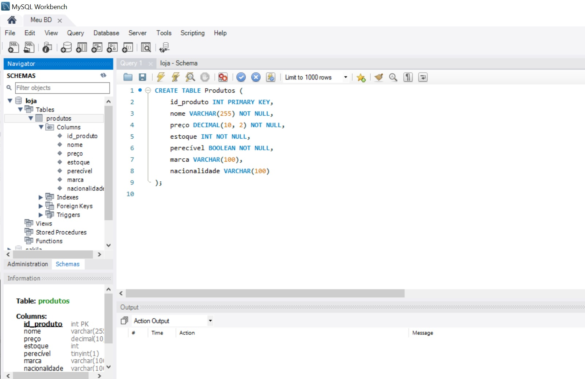
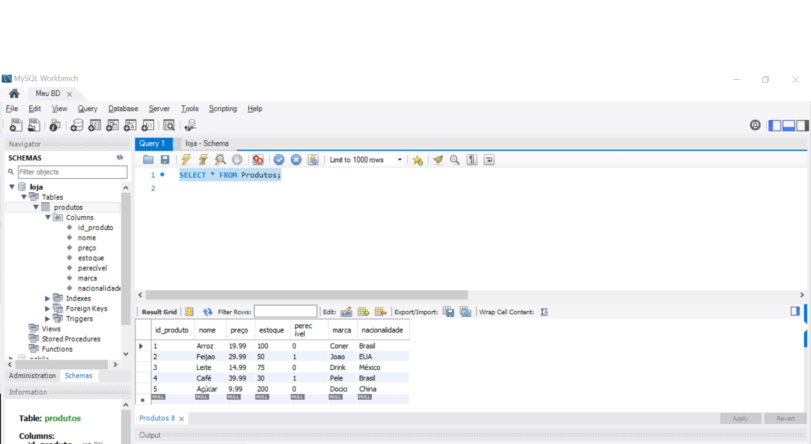
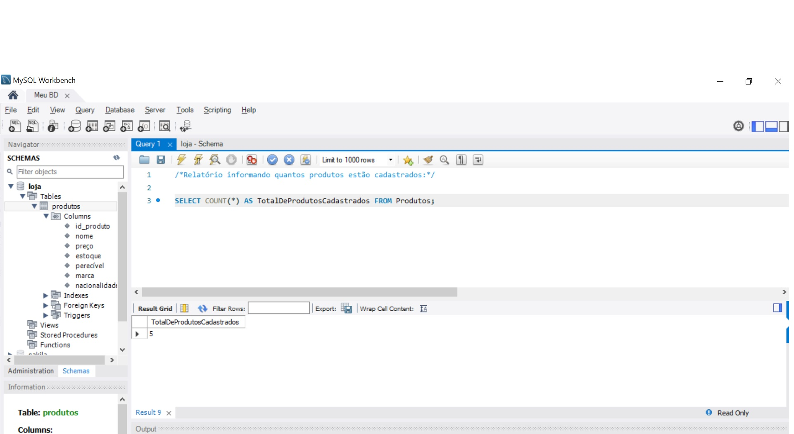
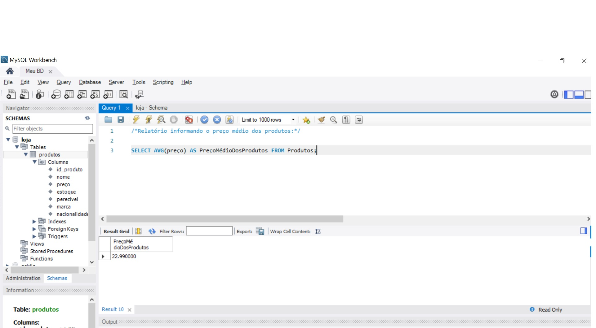
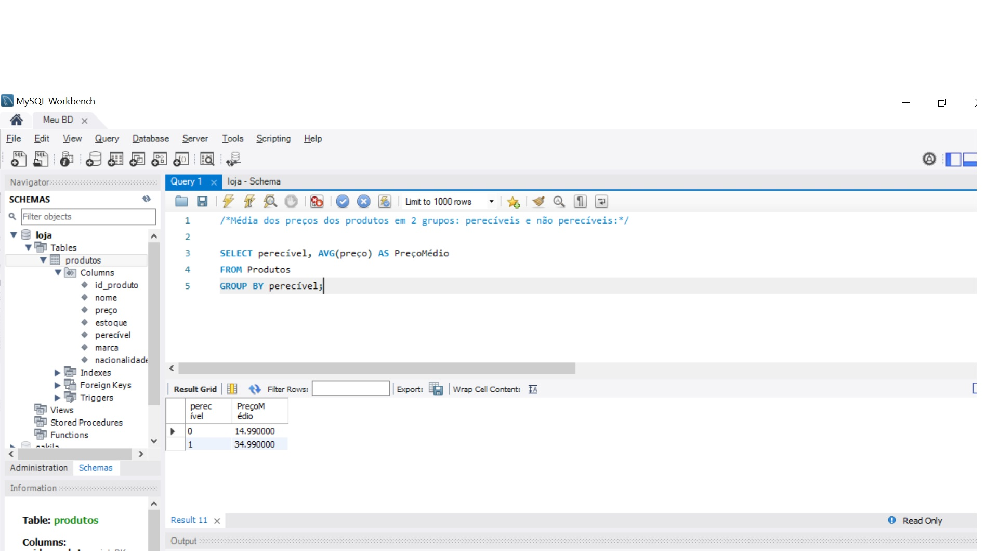

# EXERCÍCIO 1/3
ETAPA 1:

Crie uma tabela Produtos com os seguintes itens id_produto; nome; preço; estoque; perecível; marca; nacionalidade;
Atribua a cada campo seu respectivo tipo;
Os itens: nome; preço; estoque; perecível não poderão receber valores nulos;
O id_produto deve ser utilizado como chave-primaria;
Após a criação insira cinco produtos, todos devem ter seus respectivos campos preenchidos;
Verifique se todos os dados foram inseridos;
Ao término inicie a segunda etapa.

ETAPA 2:

a)Gere um relatório informando quantos produtos estão cadastrados;

b) Gere um relatório informando o preço médio dos produtos;

c)Selecione a média dos preços dos produtos em 2 grupos: perecíveis e não perecíveis;

